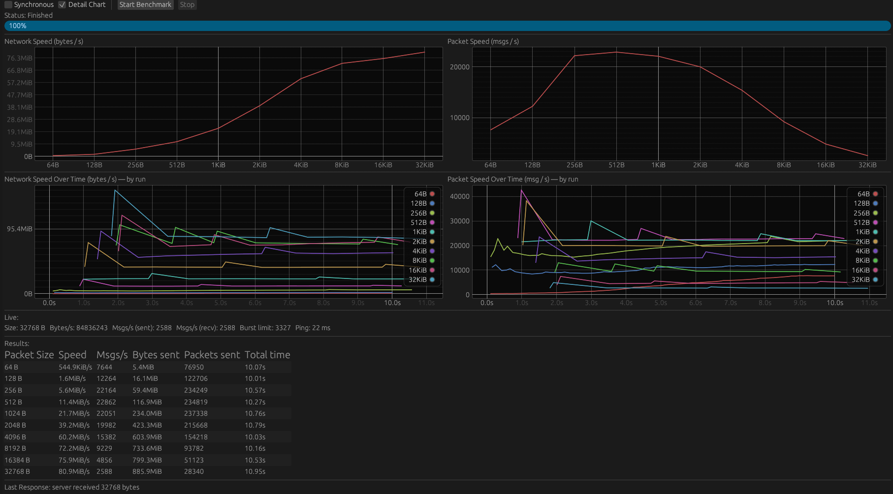

# speed-test-wasm-ws-rs

A tech demo for upload speed testing using Rust, WebAssembly, ProtoBuf and WebSockets.

> The README is AI generated coz im dead now, please bear with it

## Demo

Goto https://speed.yun.ng for a live demo.

## Overview

**speed-test-wasm-ws-rs** is a Rust project featuring both a client and server:

- **Server:** Rust-based web server (using Actix) that serves a WASM client and handles WebSocket connections.
- **Client:** WASM app built with Trunk, using egui for UI, running in the browser.
- **Proto:** Shared protobuf definitions (using Prost) for encoding/decoding speed test packets.

The client uploads protobuf packets (64B to 32KiB) to the server over WebSockets. Both sides use the shared proto module for serialization.

## Features

- Upload speed test via WebSockets
- Real-time UI with egui (client)
- Protobuf serialization (prost)
- Shared proto module for client/server
- WASM client served statically by the Rust server
- Tech demo, but functional for speed testing

## Notable Frameworks & Libraries

- **Client:**
  - [eframe/egui](https://github.com/emilk/egui) (UI)
  - [prost](https://github.com/tokio-rs/prost) (protobuf)
  - [wasm-bindgen](https://github.com/rustwasm/wasm-bindgen)
  - [web-sys](https://github.com/rustwasm/web-sys)
  - [gloo-net](https://github.com/rustwasm/gloo)
  - [egui_plot](https://github.com/emilk/egui)
- **Server:**
  - [actix-web](https://github.com/actix/actix-web)
  - [actix-ws](https://github.com/actix/actix-web)
  - [prost](https://github.com/tokio-rs/prost)
  - [tokio](https://github.com/tokio-rs/tokio)
  - [ratatui](https://github.com/tui-rs/ratatui) (terminal UI)
- **Shared:**
  - [prost](https://github.com/tokio-rs/prost)

## Project Structure

```
├── client      # WASM client (egui UI)
├── server      # Rust web server (Actix)
├── proto       # Shared protobuf definitions
├── demo.png    # Demo screenshot
├── README.md
```

## Running Locally

1. **Build everything:**
   ```bash
   ./build.sh
   cd dist && ./server # use PORT env var to set port
   ```
2. **Open browser:**  
   Visit `http://localhost:8080` or whichever port you used

## Screenshot



## License

MIT
